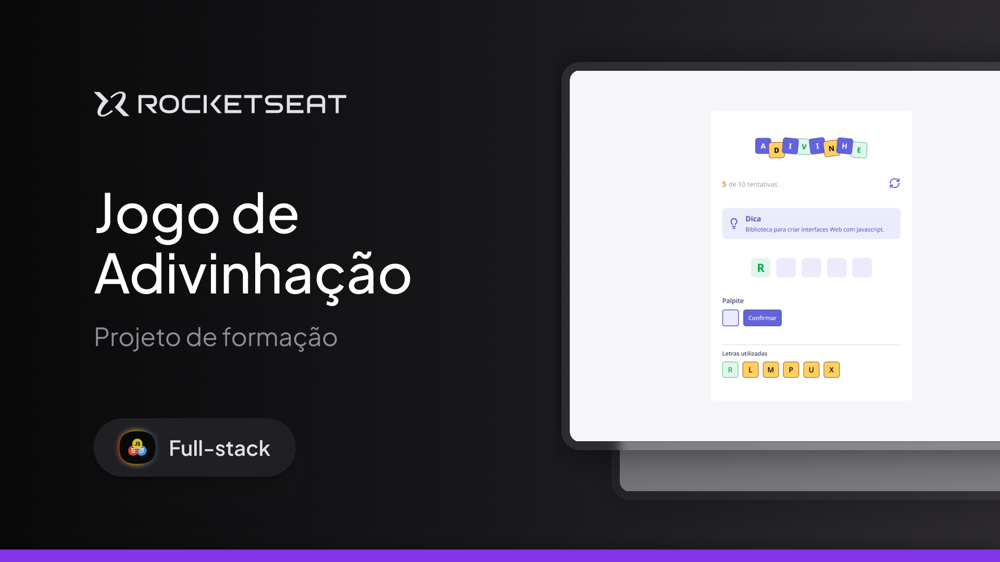

<p align="center">
  
</p>

# Jogo de Adivinhação - React

Este é um projeto de um jogo de adivinhação desenvolvido em React. O objetivo do jogo é que o jogador tente adivinhar um número aleatório gerado pelo sistema, recebendo dicas se o palpite está muito alto ou muito baixo até acertar.

<p align="center">
  
</p>

## 🚀 Tecnologias Utilizadas

O projeto foi desenvolvido utilizando as seguintes tecnologias:

- [React.js](https://reactjs.org/) - Biblioteca principal para criação da interface do usuário.
- [JavaScript (ES6+)](https://developer.mozilla.org/en-US/docs/Web/JavaScript) - Linguagem de programação utilizada no projeto.
- [HTML5](https://developer.mozilla.org/en-US/docs/Web/HTML) - Para estruturação das páginas.
- [CSS3](https://developer.mozilla.org/en-US/docs/Web/CSS) - Para estilização do jogo.
- [Node.js](https://nodejs.org/) - Para gestão de pacotes e ambiente de desenvolvimento.

## 📋 Requisitos

Antes de instalar e executar o projeto, certifique-se de ter instalado em seu ambiente:

- [Node.js](https://nodejs.org/) (versão recomendada: 16+)
- [Git](https://git-scm.com/)
- Um navegador moderno (Google Chrome, Firefox, Edge, etc.)

## 📦 Instalação e Execução

Siga os passos abaixo para clonar e rodar o projeto localmente:

1. Clone o repositório:
   ```bash
   git clone https://github.com/RicardoTavaresDias/PROJETO-REACT-JOGO-DE-ADIVINHACAO.git
   ```

2. Acesse a pasta do projeto:
   ```bash
   cd PROJETO-REACT-JOGO-DE-ADIVINHACAO
   ```

3. Instale as dependências:
   ```bash
   npm install
   ```

4. Execute o projeto:
   ```bash
   npm run dev
   ```

5. O projeto estará disponível no navegador em:
   ```
   http://localhost:3000
   ```

## 🎮 Como Jogar

- Ao iniciar o jogo, um número aleatório será gerado dentro de um intervalo definido.
- O jogador deve inserir um palpite no campo de entrada e clicar no botão para submeter.
- O jogo responderá se o palpite está muito alto, muito baixo ou correto.
- O jogador pode continuar tentando até acertar.
- Após acertar, o jogo exibe uma mensagem de sucesso e oferece a opção de reiniciar.

## 📂 Estrutura do Projeto

O projeto possui a seguinte estrutura de diretórios:
```
PROJETO-REACT-JOGO-DE-ADIVINHACAO/
│-- src/
│   │-- components/       # Componentes reutilizáveis do jogo
│   │-- assets/           # Imagens e estilos
│   │-- App.js            # Componente principal do jogo
│   │-- index.js          # Ponto de entrada da aplicação
│-- public/               # Arquivos públicos
│-- package.json          # Dependências e scripts
│-- README.md             # Documentação do projeto
```
## 🔖 Layout

Você pode visualizar o layout do projeto através [DESSE LINK](https://www.figma.com/community/file/1453366829725330797). É necessário ter conta no [Figma](https://figma.com) para acessá-lo.

---

## 📜 Licença

Este projeto está sob a licença MIT. Consulte o arquivo [LICENSE](LICENSE) para mais detalhes.

---

Caso tenha alguma dúvida ou sugestão, fique à vontade para abrir uma issue ou entrar em contato!

🎉 Divirta-se jogando! 🚀

